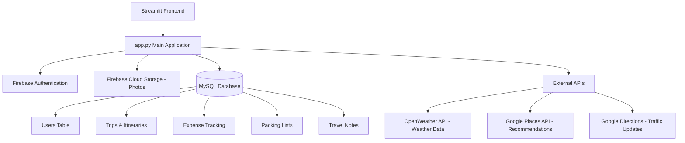

# Tripfinity: Cloud-Based AI Travel Planner ✈️

## Problem Statement
Planning a trip often involves juggling multiple apps and platforms for itineraries, expenses, packing lists, photo storage, and travel journaling. This fragmented experience can be overwhelming and inefficient, leading to scattered information, overspending, and a less enjoyable travel experience.

## Solution
**Tripfinity** is a comprehensive, cloud-based travel planning application that centralizes all aspects of trip management into a single, intuitive platform. Built with Python and Streamlit, it leverages AI and external APIs (OpenWeather, Google Places/Directions) to automatically generate itineraries, recommend attractions and restaurants, and provide real-time weather and traffic updates. With seamless integration of Firebase for secure cloud storage and MySQL for robust relational data management, Tripfinity ensures your travel plans, expenses, photos, and memories are safely stored and easily accessible from anywhere.

## Architecture Diagram


## Features
- **User Authentication:** Secure login and registration utilizing Firebase Auth combined with a local MySQL user registry.
- **AI-Powered Itineraries:** Automatically generate detailed day-by-day itineraries with visually appealing timeline views based on destination and travel dates.
- **Smart Recommendations:** Discover top-rated local attractions and restaurants seamlessly integrated via Google Places.
- **Real-time Updates:** Stay informed with live weather forecasts and traffic duration estimates between key locations.
- **Expense Tracking:** Monitor your budget effectively, log expenses by category, and view interactive pie chart breakdowns of your spending.
- **Photo Management:** Upload, organize, and view travel memories securely using Firebase Cloud Storage.
- **Interactive Packing List:** Generate custom packing checklists, add unique items, categorize them, and track your overall packing progress.
- **Travel Journaling:** Write detailed travel notes, keep track of specific locations, and log your daily mood throughout the trip.

## Folder Structure
```text
cloud_based_travel_planner/
├── api_integration.py     # Functions for external APIs (OpenWeather, Google Maps/Places)
├── app.py                 # Main Streamlit application and UI logic
├── db_utils.py            # MySQL database connection and query execution utilities
├── firebase_config.py     # Firebase configuration and storage/auth functions
├── packing_list.py        # Logic for packing list generation and management
├── photo_manager.py       # Functions to upload and fetch trip photos
├── requirements.txt       # Project dependencies
├── test_*.py              # Test cases for different modules
├── travel_notes.py        # Logic for travel journaling and mood tracking
├── trip_planner.py        # Core logic for trips, itineraries, and expenses
├── user_management.py     # User registration and auth logic combining Firebase and MySQL
├── setup_guide.md         # Instructions for setting up the project locally
└── README.md              # Project documentation
```

## Important Details
- **Hybrid Data Storage:** The application uses a hybrid database approach—MySQL for relational structured data (users, trips, itineraries, expenses) and Firebase for Authentication and Object Storage (images).
- **Database Configuration:** Ensure that the MySQL server is running locally or configured correctly in `db_utils.py` before starting the application. 
- **API Keys:** API Keys for OpenWeather and Google APIs are mandatory for full functionality (recommendations, weather, and traffic). Set them in `api_integration.py`.
- **Firebase Service Account:** A Firebase credentials JSON file is required for the Admin SDK. The absolute path to this file must be updated in `firebase_config.py`.
